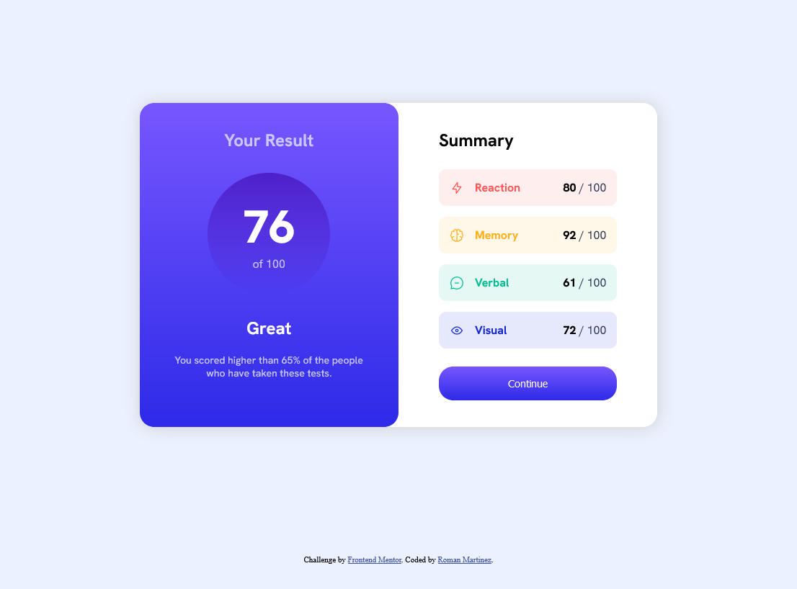
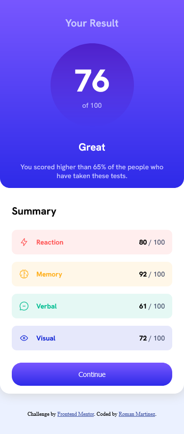

# Frontend Mentor - Results summary component solution

This is a solution to the [Results summary component challenge on Frontend Mentor](https://www.frontendmentor.io/challenges/results-summary-component-CE_K6s0maV). Frontend Mentor challenges help you improve your coding skills by building realistic projects. 

## Table of contents

- [Overview](#overview)
  - [The challenge](#the-challenge)
  - [Screenshot](#screenshot)
  - [Links](#links)
- [My process](#my-process)
  - [Built with](#built-with)
  - [What I learned](#what-i-learned)
  - [Useful resources](#useful-resources)
- [Author](#author)

**Note: Delete this note and update the table of contents based on what sections you keep.**

## Overview

### The challenge

Users should be able to:

- View the optimal layout for the interface depending on their device's screen size
- See hover and focus states for all interactive elements on the page

### Screenshot




### Links

- Solution URL: (https://www.frontendmentor.io/solutions/results-summary-component-QA8IkPudYX)
- Live Site URL: (https://euphonious-kashata-af11d5.netlify.app/)

## My process

### Built with

- HTML5
- CSS
- Flexbox
- JavaScript

### What I learned

Using fetch to read JSON file and obtain the data.
```js
fetch('././data.json')
    .then((response) => response.json())
    .then((data) => {
        main(data);
    });

```

### Useful resources

- [Example resource 1](https://stackoverflow.com/questions/1232793/javascript-set-img-src) - This helped me for setting the src of a img from JavaScript
- [Example resource 2](https://morioh.com/p/1041e78367d7) - This article helped me to read the JSON file.

## Author

- Frontend Mentor - [@ramroman163](https://www.frontendmentor.io/profile/ramroman163)